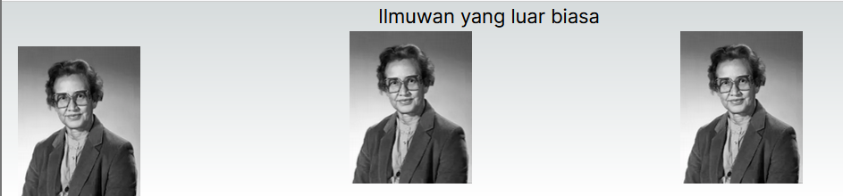
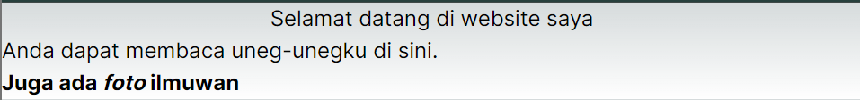
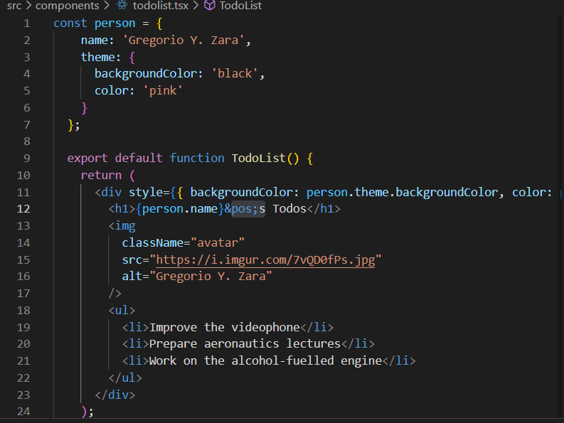
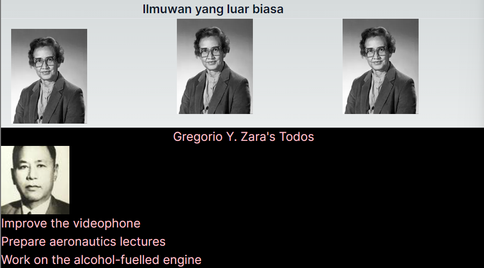
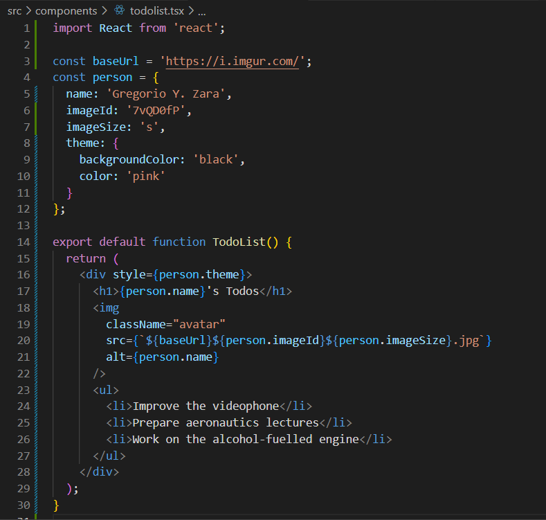

This is a [Next.js](https://nextjs.org/) project bootstrapped with [`create-next-app`](https://github.com/vercel/next.js/tree/canary/packages/create-next-app).

## Getting Started

First, run the development server:

```bash
npm run dev
# or
yarn dev
# or
pnpm dev
# or
bun dev
```

Open [http://localhost:3000](http://localhost:3000) with your browser to see the result.

You can start editing the page by modifying `app/page.tsx`. The page auto-updates as you edit the file.

This project uses [`next/font`](https://nextjs.org/docs/basic-features/font-optimization) to automatically optimize and load Inter, a custom Google Font.

## Laporan Praktikum

|  | Pemrograman Berbasis Framework 2024 |
|--|--|
| NIM |  2141720237|
| Nama |  Alvaro Hegel Ivanka |
| Kelas | TI - 3A |


### Soal 1

Ubah isi kode Home() sehingga dapat tampil seperti berikut dengan memanfaatkan komponen Profile() yang tadi sudah dibuat dari langkah 1 tersebut!

### Jawaban Soal 1


saya menambahkan domain pada next.config.mjs agar bisa mengambil gambar dari url dan saya menambahkan beberapa css untuk mengatur foto dan tulisan 

### Soal 2

Capture hasilnya dan buatlah laporan di README.md. Jelaskan apa yang telah Anda pelajari dan bagaimana tampilannya saat ini?

### Jawaban Soal 2



untuk tampilan tidak ada perubahan hanya kodenya yang berubah 

### Soal 3

Capture hasilnya dan buatlah laporan di README.md. Jelaskan apa yang telah Anda pelajari dan mengapa error itu bisa terjadi?

### Jawaban Soal 3



ada beberapa error karena ada suatu sintaks yang salah 

### Soal 4

Kode di atas masih terdapat error, silakan diperbaiki

### Jawaban Soal 4



### Soal 5

Buka file src/components/todolist.tsx lakukan ekstrak URL gambar ke dalam objek person.

Capture hasilnya dan buatlah laporan di README.md. Apakah ada perbedaan pada tampilan web saat ini?

### Jawaban Soal 5



### Soal 6

Perbaiki kode tersebut pada bagian atribut src. Kode lainnya dapat Anda sesuaikan dari jawaban soal sebelumnya. Capture hasilnya dan buatlah laporan di README.md. Jelaskan apa yang telah Anda pelajari dan bagaimana tampilannya saat ini?

### Jawaban Soal 5


pembenaran kode seperti dibawah ini




